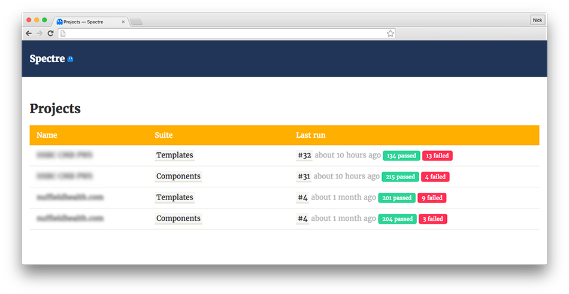
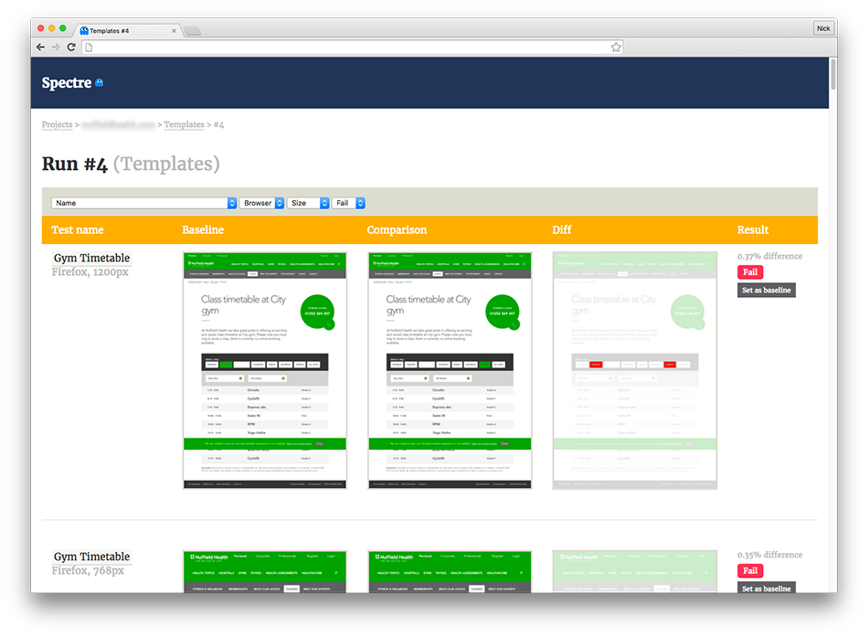

# Spectre

Spectre is a web application to diff screenshots. It's heavily influenced by [VisualReview](https://github.com/xebia/VisualReview), [BackstopJS](https://github.com/garris/BackstopJS) and [Wraith](https://github.com/BBC-News/wraith). Read more about how we use it at Friday in our blog post: [How we do visual regression testing](https://medium.com/friday-people/how-we-do-visual-regression-testing-af63fa8b8eb1).

## Running the app

You can either run the app using [docker](https://www.docker.com), or you can run it natively on your machine – there are instructions for both docker,
and running on macOS below.

Alternatively, you can run the application on [Heroku](https://www.heroku.com/).

### Running using docker

Install [docker](https://www.docker.com/products/docker)

Setup the database (only needs to be done once):

    docker-compose run --rm app bundle exec rake db:setup

To run the application:

    docker-compose up

When you see `WEBrick::HTTPServer#start: pid=2 port=3000`, the app will be running at http://localhost:3000

### Running natively on macOS

#### Prerequisites

* Ruby (doesn't currently work with v2.4.0)
* Postgres
* Imagemagick

On a Mac, the easiest way to install the above, is to use [homebrew](http://brew.sh/).

1. install homebrew using [these instructions](http://brew.sh/)
1. `brew install rbenv`
1. `rbenv install 2.3.3`
1. `rbenv init` and follow the instructions it prints
1. `brew install imagemagick`
1. `brew install postgresql` and follow the instructions it prints about starting the postgresql server

#### Setup

* Clone the repo
* `bundle install && bundle exec rake db:setup`
* `bundle exec rails s`

### Running on Heroku:

## Submitting tests

A "test" is a screenshot and associated metadata. A test is categorised under a Project, which in turn has (test) Suites. A test is submitted and associated with a "run" of a suite.

First you should create a new "run". The JSON response will contain the `run_id` to submit with each subsequent test.

    POST /runs
      project: My Project Name
      suite: My Suite Name

Then you can submit a screenshot!

    POST /tests
      test:
        run_id: {run_id from above},
        name: Homepage,
        platform: OSX,
        browser: PhantomJS,
        size: 1024,
        screenshot: <File>,
        crop_area: '640x480+50+100'

* `name` is a friendly name of your test. It should describe the template, component or state of the thing you've screenshotted
* `platform` is the OS/platform that the screenshot was taken on (e.g. OSX, Windows, iOS, Android etc.)
* `browser` is the browser that was used to render the screenshot. This will usually be a headless webkit such as Phantom, but if using Selenium you may have used a "real" browser
* `size` is the screenshot size
* `screenshot` is the image itself. PNGs are preferred
* `crop_area` allows to specify a bounding box to crop from uploaded screenshot ("<width>x<height>+<top_left_x>+<top_left_y>"). If not specified, full screenshot is used for comparison. Can be used to perform visual diffs for specific page elements.

### Integration with Rake tasks or Cucumber

Most of the time you'll want to use your own rake task to control Selenium and take screenshots, or take screenshots during cucumber step definitions. There's a handy [spectre_client gem](https://github.com/wearefriday/spectre_client) to upload screenshots to your Spectre gem.

## Example test run

An example test run can be executed using:

    docker-compose run --rm app bin/demo_test_run http://app:3000

or, if not using docker, first install [phantomjs](http://phantomjs.org/) (`brew install phantomjs`), then run:

    bin/demo_test_run http://localhost:3000

If you've deployed the app on heroku, you can replace the URL with the hosted one, e.g.:

    docker-compose run --rm app bin/demo_test_run https://your-spectre-install.herokuapp.com
    # or
    bin/demo_test_run https://your-spectre-install.herokuapp.com

## Administration

Spectre doesn't provide a UI or API to edit or delete content. We've included `rails_admin`, so head to `/admin` for this. By default there is no password.

## Contributing

### Tests

[Rspec](http://rspec.info/) and [Cucumber](https://cucumber.io) are included in the project.
Test coverage is minimal but please don't follow our lead, write tests for anything you add. Use `rake` to run the existing tests.
